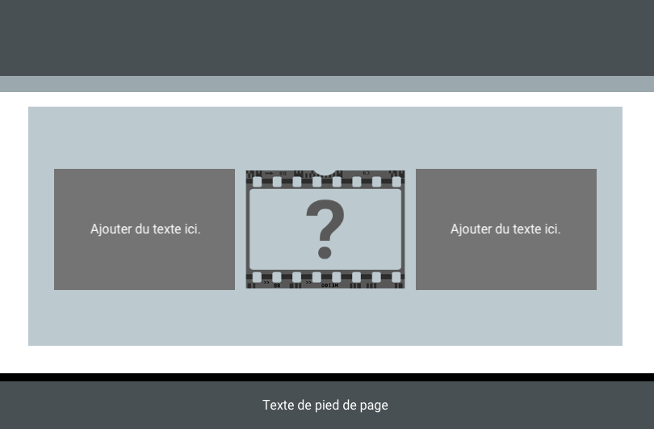

L'exemple de code crée trois tuiles. La première tuile contient du texte, la seconde tuile est une image, et la troisième tuile contient du texte. Les deux blocs de texte sont de même hauteur en utilisant la classe `tile`.

- `xcenter` place le texte au centre horizontalement
- `ycenter` place le texte au centre verticalement
- `tile` définit une hauteur fixe pour le contenu `div`

## --- code ---

language: HTML
filename: index.html
line_numbers: true
line_number_start:
line_highlights:
-----------------------------------------------------

```
  <section class="wrap">
    <div class="tertiary xcenter ycenter tile">
      <p>Ajouter du texte ici.</p>
    </div>
    
    <div class="tertiary xcenter ycenter tile">
      <p>Ajouter du texte ici.</p>
    </div>
  </section>
```

\--- /code ---

Si tu dois ajuster la hauteur des zones de texte, tu peux modifier le code CSS.

## --- code ---

language: CSS
filename: style.css
line_numbers: true
line_number_start:
line_highlights:
-----------------------------------------------------

.tile {
height: 9.4rem;
}
\--- /code ---
