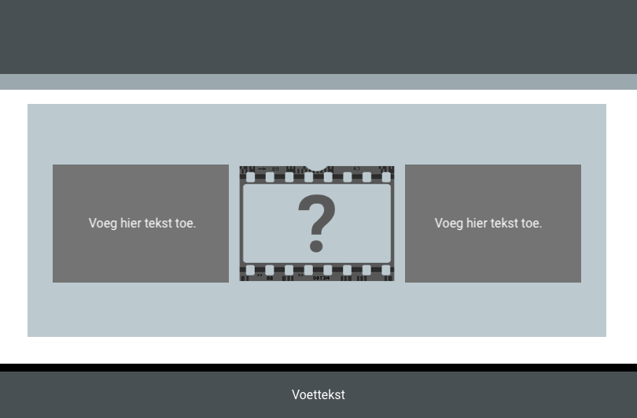

The code example creates three tiles. The first tile contains text, the second tile is an image, and the third tile contains text. The two text blocks are of equal height using the `tile` class.

- `xcenter` places the text in the centre horizontally
- `ycenter` places the text in the centre vertically
- `tile` sets a fixed height for the `div` content

## --- code ---

language: HTML
filename: index.html
line_numbers: true
line_number_start:
line_highlights:
-----------------------------------------------------

```
  <section class="wrap">
    <div class="tertiary xcenter ycenter tile">
      <p>Add text here.</p>
    </div>
    
    <div class="tertiary xcenter ycenter tile">
      <p>Add text here.</p>
    </div>
  </section>
```

\--- /code ---

If you need to adjust the height of the text boxes, then you can change the CSS code.

## --- code ---

language: CSS
filename: style.css
line_numbers: true
line_number_start:
line_highlights:
-----------------------------------------------------

.tile {
height: 9.4rem;
}
\--- /code ---
