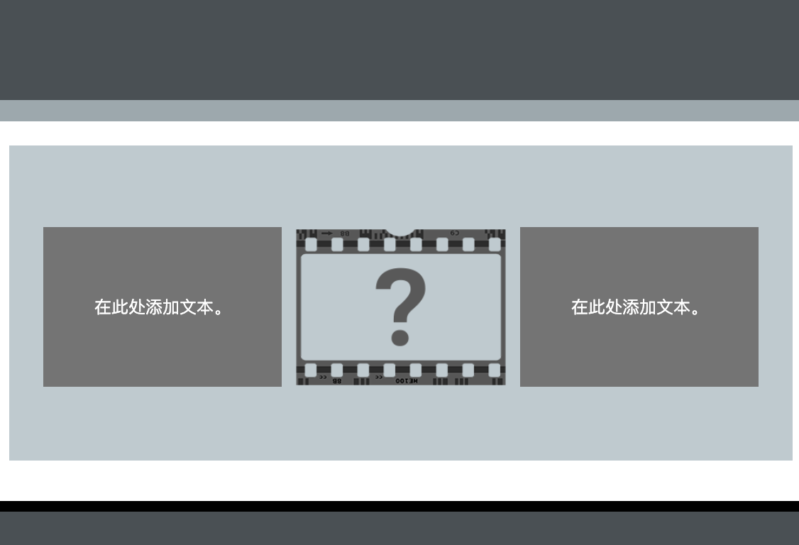

该代码示例创建了三个块。 第一个块包含文本，第二个块是图像，第三个块包含文本。 使用 `tile` 类，两个文本块的高度相等。

- `xcenter` 将文本水平居中
- `ycenter` 将文本垂直居中
- `tile` 为 `div` 内容设置固定高度
--- code ---
---
language: HTML
filename: index.html
line_numbers: true
line_number_start: 
line_highlights: 
---
  <section class="wrap">
    

      
在此处添加文本。

    

    
    

      
在此处添加文本。

    

  </section>
--- /code ---

如果需要调整文本框的高度，那么你可以更改 CSS 代码。

--- code ---
---
language: CSS
filename: style.css
line_numbers: true
line_number_start: 
line_highlights: 
---
.tile {
  height: 9.4rem;
}
--- /code ---
